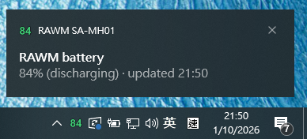

# RAWM SA-MH01 Battery Monitor



A Windows system-tray app (plus a small CLI) that shows the **battery level of
the RAWM SA-MH01 wireless mouse** right in your taskbar — no official RAWM HUB
software needed.

The tray icon *is* the percentage: a big, color-coded number that updates
automatically, refreshed by talking directly to the **RAWM Receiver** USB
dongle over HID.

## Download

the ready-to-run exe is on the
[**GitHub Releases**](https://github.com/s2031215/rawm_battery/releases) page:

- **[`RAWM.SA-MH01-v1.0.0-x64.exe`](https://github.com/s2031215/rawm_battery/releases/download/v1.0.0/RAWM.SA-MH01-v1.0.0-x64.exe)**
  (v1.0.0, ~28 MB) — fully self-contained (Python runtime + all dependencies
  packed inside), no install required: download, copy anywhere and
  double-click.

For the newest version, always check the
[Releases page](https://github.com/s2031215/rawm_battery/releases/latest).

## What it does

| Feature | Detail |
|---|---|
| Tray percentage icon | Color-coded: green ≥ 40 %, yellow ≥ 30 %, orange ≥ 20 %, red below; blue + ⚡ while charging, gray `?` until the first answer |
| Auto refresh | Every 30 min, plus immediately at app start, at login (autostart), on PC wakeup and when the screen turns on |
| Failed-read retry | If the mouse is asleep/offline, retries every 5 min instead of waiting a full interval |
| Low-battery alert | One balloon notification per app run when battery < threshold while discharging (default 20 %) |
| Adjustable alert level | Tray menu → **Notify below** → 10 / 15 / 20 / 25 / 30 % (persisted in `%APPDATA%\RAWM\tray_config.json`) |
| Start with Windows | Tray menu → **Start with Windows** toggle — per-user registry Run key, no admin rights needed |
| Device info | Firmware, sensor (e.g. PAW3395), DPI stages, polling rate via `--json` |
| Single instance | Launching it twice won't duplicate the tray icon |

## Requirements

- Windows 10 / 11
- The mouse connected through its **RAWM Receiver dongle** (VID `1915:232A`)
- **The packaged exe is fully self-contained**: the Python runtime and every
  dependency (`hidapi`, `pystray`, `Pillow`) are packed inside
  `RAWM SA-MH01.exe` — copy it to any Windows machine and run it, nothing to
  install.
- Only to run from source: Python 3.9+ with
  ```bat
  pip install -r requirements.txt
  ```

## Use

### Packaged app (recommended)

1. Download **`RAWM.SA-MH01-v1.0.0-x64.exe`** from
   [GitHub Releases](https://github.com/s2031215/rawm_battery/releases/latest)
   and double-click it.
2. A balloon confirms the first reading; the percentage appears in the tray
   (new tray icons start hidden behind the **`^` overflow chevron** — drag it
   onto the taskbar, or enable it in *Taskbar settings → Select which icons
   appear on the taskbar*).
3. To start it at every login, tick **Start with Windows** in the tray menu
   (per-user registry Run entry — no admin rights needed).

Tray menu:

- **status line** — current %, charging state, last update time, retry info
- **Refresh now** — force an immediate re-read and show the result as a
  notification (the failure reason if the mouse didn't answer)
- **Notify below** — choose the low-battery alert threshold (10–30 %)
- **Start with Windows** — tick to launch the app automatically at login
  (re-reads the actual registry/shortcut state every time the menu opens;
  unticking also removes a Startup-folder shortcut left by older versions)
- **Exit**

### CLI

```bat
python rawm_battery.py                 :: one-shot: "SA-MH01 battery: 85% (discharging)"
python rawm_battery.py --json          :: full device info (firmware, DPI, polling, ...)
python rawm_battery.py --watch         :: poll and print changes (default every 30 min)
python rawm_battery.py --watch --interval 5
python rawm_battery.py --debug         :: dump raw HID reports
```

The CLI only needs `pip install hidapi`.

### From Python

```python
from rawm_battery import read_battery

status = read_battery()          # {"battery": 85, "chr": 0, "dn": "SA-MH01", ...}
print(status["battery"], status["chr"])
```

Raises `rawm_battery.RawmReceiverError` if the dongle is missing or the mouse
doesn't answer within the timeout (move/click the mouse to wake it and retry).

## Build

```bat
pip install -r requirements.txt

python -m PyInstaller --noconfirm --clean --onefile --windowed \
    --name "RAWM SA-MH01" \
    --icon rawm.ico \
    --version-file version.txt \
    --hidden-import pystray._win32 \
    rawm_tray.py
```

- Output: `dist\RAWM SA-MH01.exe` (single file, no Python needed on the target).
- `version.txt` sets the exe metadata — its `FileDescription` is what Windows
  shows as the notification app name ("RAWM SA-MH01" instead of "Python").
- **Kill a running `RAWM SA-MH01.exe` first** — the build can't overwrite a
  locked file.

## How it works

The HID protocol was reverse-engineered from RAWM's official web hub
([rawmtech.com/hub.html](https://www.rawmtech.com/hub.html)) — it is otherwise
undocumented by the vendor. The receiver's vendor HID collection (usage page
`0xFF00`) carries a framed event protocol:

1. A `CMD_QUERY` event is sent to the receiver, wrapped in an extended-channel
   header (`0xC0 | channel 0`) that forwards it over 2.4 GHz to the mouse.
2. The mouse answers with a JSON blob (`"battery"`, `"chr"`, `"dn"`, `"cpi"`,
   ...) framed as `FF FF FF FF [cmd|len_hi] [len_lo] <payload>`.
3. The battery also arrives as a push notification (`CMD_NOTIFY`, type
   `0x17`: percent + charging flag), and RSSI as type `0x1C`.

`rawm_battery.py` implements the query/parsing; `rawm_power.py` listens for
Windows power events (`WM_POWERBROADCAST`: system resume +
`GUID_MONITOR_POWER_ON`) to trigger extra refreshes.

## Files

| File | Purpose |
|---|---|
| `rawm_battery.py` | HID protocol + CLI (`read_battery()`, `watch()`) |
| `rawm_tray.py` | Tray app (icon, menu, notifications, refresh schedule) |
| `rawm_power.py` | Resume / screen-on event watcher |
| `rawm_autostart.py` | Start-with-Windows registry Run-key toggle |
| `requirements.txt` | Python dependencies (runtime + build), pinned versions |
| `dist` | Packaged app |
| `rawm.ico` | App icon |
| `version.txt` | exe version metadata (notification app name) |
| `test_power_watch.py` | Component test for the power watcher |
| `test_autostart.py` | Component test for the autostart toggle |

## Troubleshooting

- **"RAWM Receiver not found"** — dongle not plugged in (or another app holds
  it exclusively); replug the dongle.
- **"No answer from the mouse"** — the mouse is asleep or out of range; move
  or click it. A failed check retries automatically after 5 min.
- **Percentage looks stale** — hover the icon: the tooltip shows the update
  time; use *Refresh now* or wait for the next scheduled/sleep-wake check.
- **Icon not visible in the tray** — check the `^` overflow area; to pin it:
  *Taskbar settings → Select which icons appear on the taskbar → rawm_battery*.

## Disclaimer

Unofficial tool for personal use; not affiliated with RAWM. The HID protocol
is undocumented and may change with firmware updates — if the tool stops
working after a firmware update, the command/notify layout above needs to be
re-derived from the official companion software's traffic.
